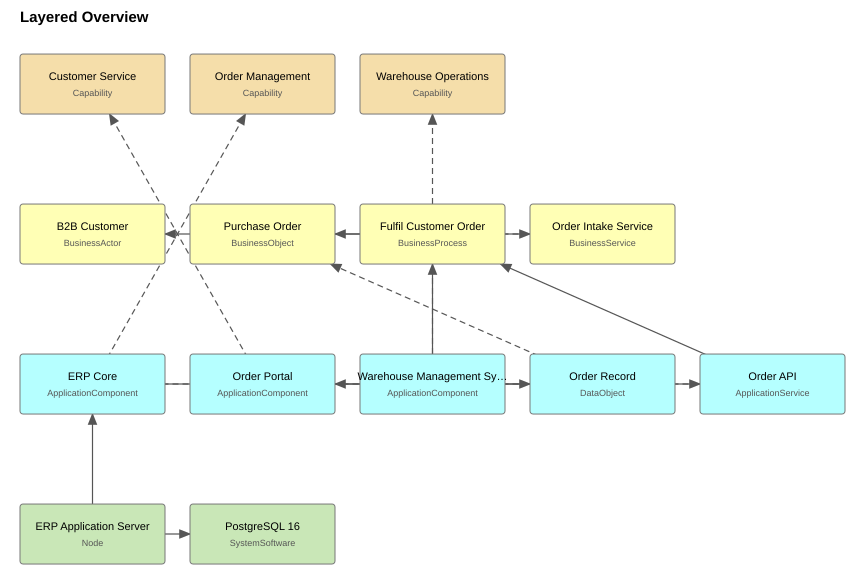
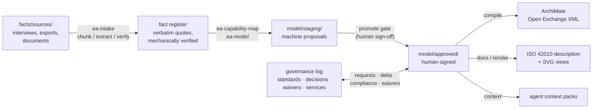

<div align="center">

# ea-skills

**The full enterprise-architecture lifecycle — define, document, govern, maintain — as agent skills over a deterministic core.**

Unstructured input in. Validated ArchiMate 3.2, generated views, ISO 42010 documentation
and living governance out. All of it in git.

[](https://github.com/dithiothreitol/ea-skills/actions/workflows/ci.yml)
[](pyproject.toml)
[](LICENSE)
[](docs/RULES.md)
[](oracle/NOTICE.md)
[](docs/RULES.md)

[Quickstart](#quickstart) ·
[How it works](#design-principles) ·
[Tutorial](docs/GETTING-STARTED.md) ·
[CLI reference](docs/CLI.md) ·
[Rule catalogue](docs/RULES.md) ·
[Design & research](docs/BLUEPRINT.md) ·
[Contributing](CONTRIBUTING.md)

</div>

---

> **The model supplies judgement. The tooling supplies proof.**
> Anything a language model asserts about ArchiMate semantics, or about what a source
> document says, is checked by code against vendored primary-source data before it can
> enter the repository.

That inverts the usual arrangement, and it is deliberate. The research this design is
built on ([full grounding](docs/BLUEPRINT.md)) found three failure modes, and each one
gets a mechanical answer rather than a hope:

| Documented failure mode | Mechanical answer |
|---|---|
| Relationship semantics is the **weakest measured LLM capability** on modelling tasks | Every relationship is checked against Archi's vendored, hash-pinned ArchiMate 3.2 matrix (11 569 permitted pairs) — `REL001` even tells you when your endpoints are just swapped |
| LLMs **fabricate citations** — rationales quoting sentences that do not exist | Every concept carries a verbatim quote that the validator *locates in the actual source file*, or an explicit `assumed: true` with a rationale. There is no third option |
| EA repositories **die of staleness** — content nobody owns, that nobody revisits | Ownership and review dates are mandatory in the approved zone; dispensations expire *loudly*; the staleness queue is ordered by real consumer demand |

## What it looks like

The worked example — a small fictional B2B food manufacturer — rendered by the
built-in, dependency-free SVG renderer from the same deterministic layout the
compiler uses:

<div align="center">



</div>

A clean gate, with the one declared assumption surfaced instead of buried:

```
$ python -m easkills validate --root eval/example
EA model validation -- zone 'approved' at .../eval/example
ArchiMate oracle 3.2; 17 elements, 15 relationships, 4 views

INFO    PROV006  model/approved/strategy.yaml:elements[3] [goal-shorten-lead-time]
         assumed, pending confirmation: Inferred from operational pain described in the
         interview, not stated as a goal by any stakeholder. Needs confirmation at the
         next architecture board.

0 error(s), 0 warning(s) -- PASS
```

And what a real catch looks like:

```
ERROR   REL001  model/approved/broken.yaml:relationships[1] [rel-swapped]
         Realization from BusinessProcess 'process-invoicing' to ApplicationComponent
         'app-finance' is not permitted by the ArchiMate 3.2 relationship matrix.
         Permitted here: Association, Flow, Serving, Triggering -- it is permitted in the
         opposite direction, so the endpoints are probably swapped
```

Output is colorized on interactive terminals and degrades to plain text in pipes, CI
logs and captures — colour is display, never data (`NO_COLOR` / `FORCE_COLOR`
respected).

## Quickstart

```bash
git clone https://github.com/dithiothreitol/ea-skills.git && cd ea-skills
python -m pip install -r requirements.txt

# Tour the worked example: every gate, end to end
python -m easkills validate       --root eval/example          # model gate
python -m easkills validate-facts --root eval/example          # evidence gate
python -m easkills validate-gov   --root eval/example          # governance gate
python -m easkills compile        --root eval/example          # -> ArchiMate Open Exchange XML
python -m easkills docs           --root eval/example          # -> ISO 42010 description + SVGs
python -m easkills context --root eval/example --scope app-erp-core   # agent context pack
```

To start your own architecture repository, copy [`template/`](template/) and follow
the [Getting-started tutorial](docs/GETTING-STARTED.md) — from a raw interview to a
validated model, rendered views and a generated architecture description.

## The pipeline



Every arrow is a deterministic command with an exit-code contract, and every stage is
driven by one of the **22 [agent skills](skills/)** — from `ea-intake` through
`ea-approve` to `ea-board`. The orchestrator (`ea-run`) routes requests catalog-first
and keeps the stage order honest.

| Stage | Skills | Deterministic gate |
|---|---|---|
| Ingest | `ea-intake`, `ea-delta-ingest`, `ea-import` | `validate-facts`, `coverage --min-coverage`; `import` lands in staging, all `assumed` |
| Model | `ea-capability-map`, `ea-model`, `ea-validate` | `validate` (staging as overlay), 3-repair cap |
| Publish | `ea-approve` | `promote` — the only write path into `approved/` |
| Document | `ea-stakeholders`, `ea-views`, `ea-docs` | `docs`, `render`, ISO loop rules, freshness CI check |
| Govern | `ea-standards-base`, `ea-dispensation`, `ea-adr`, `ea-compliance`, `ea-service` | `validate-gov` — expiry and SLA are enforced, not filed |
| Maintain | `ea-health`, `ea-change-triage`, `ea-board`, `ea-context` | `kpi`, `debt`, `staleness`, `conformance`, `correspondences`, `delta`, `context` |
| Consume | `ea-check` | `check --scope` inside a product repo — standards lifecycle vs declared dependencies |
| Evaluate | `ea-eval` | `score --min-f1` against the [golden set](eval/golden/) |

## Design principles

**Authoring format is fragmented YAML** (`model/<zone>/*.yaml`), so git diffs stay
reviewable at concept level. Open Exchange XML is a build artifact, never hand-edited.
Identifiers are author-supplied stable slugs, so re-running a pipeline produces a
reviewable diff rather than a rewrite.

**Two zones, one write path.** `staging/` holds machine proposals; `approved/` holds
human-signed content. Staging validates as an *overlay* on approved (a proposal may
reference approved elements; re-using an id proposes an update), so skills model the
delta rather than copying the world. The only way into `approved` is
`python -m easkills promote`, whose gate validates the merged result by approved-zone
standards — ownership and review dates, advisory while drafting, block there. The git
commit of the move is the approval record.

**Intake comes first and is measured.** `ea-intake` extracts a **fact register**
(`facts/register/*.yaml`) from raw sources chunk by chunk: atomic statements, each with
a verbatim quote the validator locates mechanically, plus an entity table
(`facts/entities.yaml`) so "the portal" and "Order Portal" stay one thing. Facts have
no `assumed` escape hatch — what the sources do not say becomes a clarification
question, and the coverage report lists every source statement no fact cites, with
line numbers, so "we ingested everything" is a checked claim rather than a felt one.

**Every model concept is evidenced or declared.** Each element and relationship carries
`provenance` — a source file plus verbatim quote which the validator locates in the
actual file, or a reference to a fact whose quotes are re-verified transitively — or
`assumed: true` with a rationale, which surfaces as an open question. There is no
third option, and no way to quietly invent an element.

```yaml
elements:
  - id: app-erp-core
    type: ApplicationComponent
    name: ERP Core
    owner: finance-systems@aurorafoods.example
    lastReviewed: 2026-06-30
    properties:
      timeDisposition: Tolerate     # portfolio views come free, not from re-modelling
      lifecycle: active
    provenance:
      - file: facts/sources/interview-operations-2026-07-15.md
        quote: The ERP core holds the master order records and does the invoicing
```

**The motivation layer binds, mechanically.** Requirements, constraints, principles
and goals carry an `appliesTo` selector naming the elements they bind; the validator
checks every binding resolves and that selectors stay on motivation elements.

**Views declare content, not geometry — and a purpose.** A view lists which elements
to show and which declared stakeholder concerns it frames (ISO 42010's loop:
stakeholder ↔ concern ↔ view, closed by the `ISO*` rules). The compiler computes a
deterministic layered layout; the renderer draws the same layout as dependency-free,
byte-stable SVG. Neither a person nor a model hand-places coordinates, so diffs stay
about architecture.

**Governance is records + gates + diffs, git-native.** Standards live one per file
with a lifecycle; an element referencing a retired standard is an *error* unless an
open dispensation covers it — and dispensations carry a schema-mandatory expiry that
turns into an error the day it passes, so exceptions stay governed instead of silent.
Decisions are MADR-shaped with mandatory rationale (ISO 42010 §6.10); compliance
verdicts use TOGAF's six levels, and a non-conformant verdict with no follow-up is
flagged. The git commit of any record is its audit trail.

**EA runs as a service, and demand steers maintenance.** The catalog (`services/`)
defines what EA provides — every offering with a named owner, a fulfilment path and an
SLA in days, schema-mandatory. The demand ledger (`governance-log/requests/`) records
who asked for what: fulfilment must point at the deliverable, refusals need a written
reason, and an open request past its SLA lands in KPI as a breach. Demand feeds back:
the staleness review queue orders by how often consumers actually ask about an
element, and never-requested content is named a de-scoping candidate — architecture
grows on demand, and rots only where nobody is looking anyway.

**The model governs agents, not just people.** `python -m easkills context --scope
<system>` produces a scoped extract for coding agents in downstream repos: binding
requirements via `appliesTo`, standards with lifecycle and waivers, applicable
decisions, integration neighbours — opened by a mandatory freshness label, because a
stale model served as binding constraints carries false authority.

**Documentation is generated, committed, and provably fresh.** `python -m easkills
docs` produces the architecture description (Clause 6 shape: stakeholders → concerns
→ views, plus portfolio TIME quadrants, capability support and every open assumption)
from `model/approved/` only. Output is deterministic — the "as of" date is the newest
`lastReviewed` in the model, not the wall clock — so the generated files are committed
and CI fails when they go stale.

**The oracle is vendored and hash-pinned.** Semantic rules come from Archi's
`relationships.xml` (the ArchiMate 3.2 permitted-relationship matrix) and the Open
Group exchange schemas — not from rules typed from memory, and genuinely not fetched
at runtime: schema building runs with the network disabled at parser level, and a test
proves it. See [`oracle/NOTICE.md`](oracle/NOTICE.md). The JSON Schema for the DSL is
*generated* from the same oracle, so the authoring format cannot drift from the
validator.

## Standards position

| Concern | What is used | How |
|---|---|---|
| Notation | **ArchiMate 3.2** | Primary. Enforced from the machine-readable matrix, exported as Open Group Model Exchange XML. |
| Architecture description | **ISO/IEC/IEEE 42010:2022** | Documentation structure and conformance checking: stakeholders, concerns, viewpoints, views, decisions with rationale, and §6.9 correspondences derived from the records that declare them — never authored twice. |
| Method and governance | **TOGAF 10** | Used as vocabulary and for governance mechanics (conformance levels, dispensations with expiry, Phase H change classes) — *not* as a process to march through. |
| Detail design | **UML** | Secondary, where ArchiMate is too coarse (sequences, deployment). |
| Decisions | **MADR** | Architecture decision records in the governance log. |

On TOGAF specifically: the empirical case-study literature finds that even
self-described TOGAF practices do not follow the ADM or use the Content Framework, and
that the single most-used EA artifact in practice — the business capability map — is
not in TOGAF's content metamodel at all. So this repository targets the artifact set
practitioners are documented to actually use (capability map first, then landscapes,
inventories, roadmaps, principles, standards, solution overviews, decision records)
and implements TOGAF where it is genuinely strong: governance mechanics.

## How it compares

There is no shortage of adjacent work: Claude skills that advise on TOGAF, MCP servers
that manipulate Archi models, tools that lint architecture-as-code in bespoke YAML,
markdown-only governance frameworks, and commercial platforms with real ingestion
agents. What is not otherwise available is the *combination*:

| Capability | ea-skills | mcp-archimate | 7bots / archimate-deep-agent | Transitrix | ArcKit | Ardoq |
|---|---|---|---|---|---|---|
| Packaged as agent skills | ✓ | — (MCP server) | — (platform) | partial (plugins) | ✓ | — (SaaS) |
| Unstructured-input ingestion | ✓ verified quotes | — | ✓ | ✓ | partial | ✓ |
| Real ArchiMate model files (Open Exchange) | ✓ XSD-validated, both directions (compile + brownfield import) | ✓ | ✓ | — (custom YAML) | — (markdown) | — |
| Generated views | ✓ deterministic SVG | ✓ | — | — | — | ✓ |
| Per-element source traceability | ✓ mechanically verified | — | ✓ claimed | partial | ✓ doc-level | partial |
| Deterministic semantic validation | ✓ vendored 3.2 matrix | ✓ | — | ✓ (own rules) | — | partial |
| Standards-shaped documentation (ISO 42010) | ✓ + conformance checklist | — | — | — | — | — |
| Governance + maintenance (SIB, dispensations with expiry, debt, staleness, service catalog, agent context packs) | ✓ | — | — | partial (PR gate) | partial (docs) | partial |

Verified against the 2026-07-29 competitive survey behind
[`docs/BLUEPRINT.md`](docs/BLUEPRINT.md); the ea-skills column reflects this
repository as of 2026-08-04. Neighbours move fast, so this table carries a standing
obligation: **re-check monthly, and correct it when a claim stops being true** — it is
tracked as an open item below and in [BLUEPRINT §8a](docs/BLUEPRINT.md), because no
test can check a competitor's changelog. Each capability exists somewhere; the
integration is the contribution, and the governance end is where it is thinnest
elsewhere.

## Status and roadmap

**All planned phases are complete** — see [CHANGELOG.md](CHANGELOG.md) for the full
history and [BLUEPRINT §8a](docs/BLUEPRINT.md) for per-phase design decisions.

| Phase | Scope | Status |
|---|---|---|
| 0 | Deterministic core: DSL, three-layer validator, Open Exchange compiler, oracle pinning | **done** |
| 1 | Intake: fact register with verified quotes, chunker, coverage, clarification questions | **done** |
| 2 | Modelling: capability map as spine, overlay staging, gated promotion, motivation layer | **done** |
| 3 | Documentation: ISO 42010 loop, SVG rendering, generated architecture description | **done** |
| 4 | Governance & maintenance: SIB, dispensations, ADRs, compliance, health reports, agent context packs | **done** |
| 5 | Evaluation: golden-set regression harness, capability comparison | **done** |
| 6 | Service layer: offering catalog with SLAs, demand ledger, demand-weighted maintenance | **done** |

Deliberately open (decisions, not backlog): the **network facade** (MCP/HTTP) over the
read-only commands stays deferred until the demand ledger shows someone asking for it —
`ea-check` shipped without it, and needs no service to run; §6.9 correspondences to AD
elements in *another* architecture description stay underived, because nothing here can
check the far end of one; the [comparison table](#how-it-compares) above carries a monthly
re-check obligation that nothing can automate; and the worked example carries
*scheduled* failures (a dispensation expiring 2027-06-30, a staleness horizon in
mid-2027) as maintenance rehearsals — renewing the records, not weakening the gates,
is the drill.

## Repository layout

```
easkills/        deterministic tooling (oracle, DSL, validators, compiler, renderer,
                 docgen, governance, reports, context packs, scorer, CLI)
oracle/          vendored, hash-pinned rule data + NOTICE.md
schema/          JSON Schemas -- all generated, never hand-edited
skills/          the 22 agent skills (this is the product)
template/        scaffold to copy for a new enterprise
eval/example/    worked example, clean (doubles as the largest golden case)
eval/golden/     golden-set cases for the regression harness
eval/fixtures/   negative fixtures -- every rule violated on purpose, proven by tests
tests/           pytest suite: the gates, the generators, and the claims these docs make
docs/            GETTING-STARTED, CLI reference, RULES catalogue, BLUEPRINT (design)
```

## Documentation

| Document | What it covers |
|---|---|
| [Getting started](docs/GETTING-STARTED.md) | Tutorial: from a raw interview to a validated, documented architecture |
| [CLI reference](docs/CLI.md) | Every command, flag and exit-code contract |
| [Rule catalogue](docs/RULES.md) | All 111 validation rules with severities and rationale |
| [Blueprint](docs/BLUEPRINT.md) | The research-verified design: decisions, evidence, per-phase log |
| [Golden set](eval/golden/README.md) | How pipeline quality is measured |
| [Contributing](CONTRIBUTING.md) | Dev setup, conventions, how to add a rule or a skill |

## Contributing

Contributions are welcome — the conventions are strict but few, and every one of them
is enforced by a test rather than a review comment. Start with
[CONTRIBUTING.md](CONTRIBUTING.md); the short version:

- every new validator rule ships with a negative-fixture case, a RULES.md row and a test;
- generated artifacts (schemas, example docs) are regenerated in the same commit;
- gold's *authored* content never changes in the same commit as skill changes (its
  generated `eval/example/docs/` regenerates with the tooling — that is convention 2);
- the worked example stays at zero findings, warnings included.

```bash
python -m venv .venv && .venv/Scripts/python -m pip install -r requirements.txt
.venv/Scripts/python -m pytest tests -q          # the suite
.venv/Scripts/python -m easkills oracle-info     # oracle version + pin status
```

## License

MIT for the code in this repository — see [LICENSE](LICENSE). The vendored oracle
files are third-party material with their own terms — see
[`oracle/NOTICE.md`](oracle/NOTICE.md).
