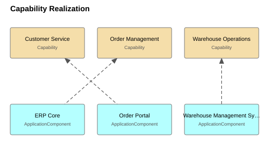
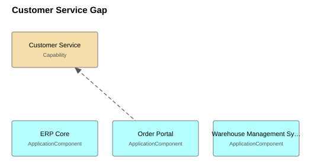
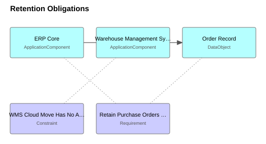

# Aurora Foods Enterprise Architecture — Architecture Description

Worked example shipped with the ea-skills repository. Aurora Foods is fictional; the model exists to exercise the validator and compiler end to end, and to show what evidence-backed modelling looks like in practice.

**As of:** 2026-07-15 (newest `lastReviewed` in the approved model) · 17 elements, 15 relationships, 4 views.

> Generated from `model/approved/` by `python -m easkills docs`. Do not edit; change the model and regenerate. Structured after ISO/IEC/IEEE 42010:2022 Clause 6 (stakeholders → concerns → viewpoints → views).

## 1. Stakeholders and concerns

| Stakeholder | Who they are | Concerns |
|---|---|---|
| **External Auditor** | Verifies purchase-order retention during the annual audit. | Are purchase orders retained for the required seven years, and where? |
| **CIO** | Owns the application portfolio and its budget. | Which applications support which capability, and where is investment or retirement due? How exposed is order capture to a single point of failure? |
| **Head of Operations** | Runs order-to-delivery; interviewed 2026-07-15. | How exposed is order capture to a single point of failure? Why does answering "where is my order" require opening three systems? |

## 2. Concern coverage

| Concern | Held by | Framed in |
|---|---|---|
| Are purchase orders retained for the required seven years, and where? | External Auditor | Retention Obligations |
| Why does answering "where is my order" require opening three systems? | Head of Operations | Customer Service Gap |
| How exposed is order capture to a single point of failure? | CIO, Head of Operations | Layered Overview |
| Which applications support which capability, and where is investment or retirement due? | CIO | Capability Realization |

## 3. Views

### Capability Realization

**Viewpoint:** Capability Map · **Frames:** Which applications support which capability, and where is investment or retirement due?

Which application supports which capability. Frames the portfolio-rationalisation concern for the CIO: one capability with a Tolerate-rated system behind it.

| Element | Type | Owner |
|---|---|---|
| ERP Core | ApplicationComponent | finance-systems@aurorafoods.example |
| Order Portal | ApplicationComponent | ecommerce@aurorafoods.example |
| Warehouse Management System | ApplicationComponent | logistics-it@aurorafoods.example |
| Customer Service | Capability | ea@aurorafoods.example |
| Order Management | Capability | ea@aurorafoods.example |
| Warehouse Operations | Capability | ea@aurorafoods.example |

### Customer Service Gap

**Viewpoint:** Application Usage · **Frames:** Why does answering "where is my order" require opening three systems?

The three systems a service agent opens to answer "where is my order", against the capability the interview called the weak spot. The gap is the absence of a single order-status service in front of them.

| Element | Type | Owner |
|---|---|---|
| ERP Core | ApplicationComponent | finance-systems@aurorafoods.example |
| Order Portal | ApplicationComponent | ecommerce@aurorafoods.example |
| Warehouse Management System | ApplicationComponent | logistics-it@aurorafoods.example |
| Customer Service | Capability | ea@aurorafoods.example |

### Layered Overview

**Viewpoint:** Layered · **Frames:** How exposed is order capture to a single point of failure?

Whole-model overview from capabilities down to infrastructure. Shows the single integration path (portal -> order API -> ERP) whose failure stops order capture.

| Element | Type | Owner |
|---|---|---|
| B2B Customer | BusinessActor | sales@aurorafoods.example |
| ERP Core | ApplicationComponent | finance-systems@aurorafoods.example |
| Order Portal | ApplicationComponent | ecommerce@aurorafoods.example |
| Warehouse Management System | ApplicationComponent | logistics-it@aurorafoods.example |
| Customer Service | Capability | ea@aurorafoods.example |
| Order Management | Capability | ea@aurorafoods.example |
| Warehouse Operations | Capability | ea@aurorafoods.example |
| Order Record | DataObject | finance-systems@aurorafoods.example |
| ERP Application Server | Node | infrastructure@aurorafoods.example |
| Purchase Order | BusinessObject | operations@aurorafoods.example |
| Fulfil Customer Order | BusinessProcess | operations@aurorafoods.example |
| Order API | ApplicationService | finance-systems@aurorafoods.example |
| Order Intake Service | BusinessService | sales@aurorafoods.example |
| PostgreSQL 16 | SystemSoftware | infrastructure@aurorafoods.example |

### Retention Obligations

**Viewpoint:** Motivation · **Frames:** Are purchase orders retained for the required seven years, and where?

What the seven-year retention requirement binds: the order record and the ERP core that stores it. Applicability bindings are drawn dotted; they are selector links, not ArchiMate relationships.

| Element | Type | Owner |
|---|---|---|
| ERP Core | ApplicationComponent | finance-systems@aurorafoods.example |
| Warehouse Management System | ApplicationComponent | logistics-it@aurorafoods.example |
| WMS Cloud Move Has No Approved Budget | Constraint | ea@aurorafoods.example |
| Order Record | DataObject | finance-systems@aurorafoods.example |
| Retain Purchase Orders for Seven Years | Requirement | ea@aurorafoods.example |

## 4. Application portfolio

| Application | TIME | Lifecycle | Functional fit | Technical fit | Hosting | Owner |
|---|---|---|---|---|---|---|
| ERP Core | Tolerate | active | adequate | poor | on-premise | finance-systems@aurorafoods.example |
| Order Portal | Invest | active | good | good | managed cloud | ecommerce@aurorafoods.example |
| Warehouse Management System | Migrate | active | good | adequate | on-premise | logistics-it@aurorafoods.example |

**TIME quadrants:** Invest: Order Portal · Migrate: Warehouse Management System · Tolerate: ERP Core

## 5. Capability support

| Capability | Assessment | Realized by |
|---|---|---|
| Customer Service | — | Order Portal |
| Order Management | — | ERP Core |
| Warehouse Operations | — | Warehouse Management System |

## 6. Assumptions and open questions

The following concepts are **declared assumptions** (`assumed: true`), not source-evidenced facts. Each needs confirmation or removal:

- **Shorten Order-to-Delivery Lead Time** (Goal): Inferred from operational pain described in the interview, not stated as a goal by any stakeholder. Needs confirmation at the next architecture board.
- **rel-order-management-realizes-goal** (Realization): Depends on the inferred goal; confirm together with goal-shorten-lead-time.

---

*Correspondences (ISO 42010 §6.9) and architecture decisions (§6.10) are kept in the governance log and joined into this description in a later phase.*
